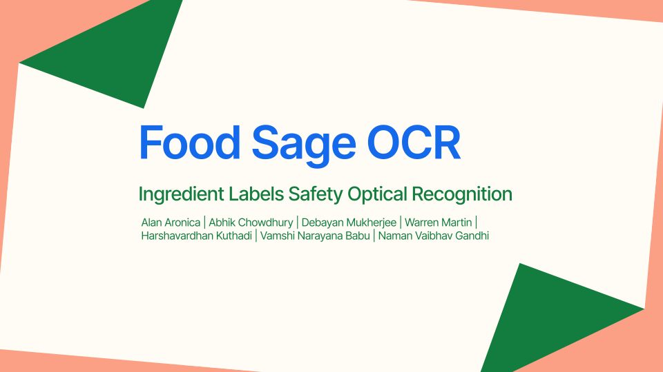
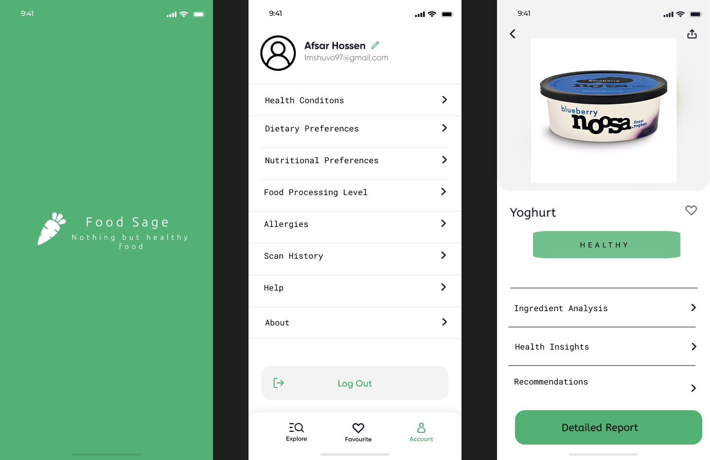
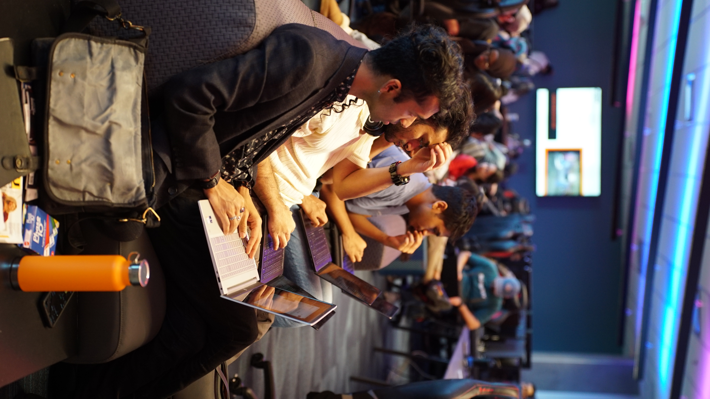
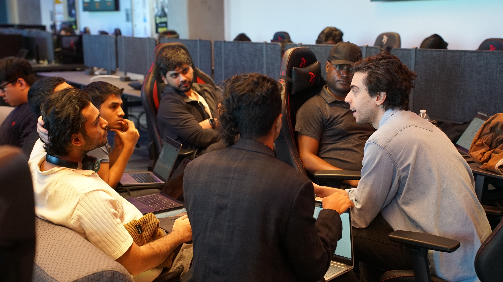

<div align="center">

# FOOD SAGE
🥇First place price at ASU Voxel 51 hackathon🥇

### 



[📊 View Presentation Slides](https://docs.google.com/presentation/d/1u80asFoXy3CAD9kbjpGT07EIE81hVsMWVG9PRRlS4aQ/edit?usp=sharing) | [🎨 Explore Hi-Res Designs](https://www.figma.com/design/pklM3epxNVo4HSGisRJAL9/Untitled?node-id=0-1&p=f&t=FlBFSLUj88XjPNYQ-0)

</div>

---

## 💡 The Vision

**FOOD SAGE** is revolutionizing how consumers interact with processed foods. By simply scanning a product's ingredient list, our application instantly analyzes and categorizes ingredients based on potential health impacts.

<div align="center">
  
</div>

## 🚀 What We've Built

FOOD SAGE leverages advanced computer vision and machine learning to:

### 📸 Extract Ingredients in Real-Time

Our advanced OCR system identifies and isolates ingredient lists from food packaging with precision.

<div align="center">
  
</div>

### 🔍 Categorize Ingredients

We categorize ingredients into three risk levels:

<div class="risk-categories" style="overflow-x: auto;">
  <table style="width: 100%; min-width: 280px; margin: 0 auto;">
    <tr>
      <td style="padding: 10px; text-align: center; vertical-align: top;"><span style="color:#e74c3c">⚠️ <b>High Risk</b></span><br>Ingredients that are generally considered harmful or controversial.</td>
    </tr>
    <tr>
      <td style="padding: 10px; text-align: center; vertical-align: top;"><span style="color:#f39c12">⚠️ <b>Moderate Risk</b></span><br>Ingredients that may be of concern depending on quantity, processing, or context.</td>
    </tr>
    <tr>
      <td style="padding: 10px; text-align: center; vertical-align: top;"><span style="color:#2ecc71">🌿 <b>Low Risk</b></span><br>Ingredients widely regarded as safe under normal consumption.</td>
    </tr>
  </table>
</div>

<style>
@media (min-width: 768px) {
  .risk-categories table tr {
    display: flex;
  }
  .risk-categories table td {
    flex: 1;
  }
}
</style>

### 🔮 Enable Further Analysis

We've laid the groundwork for future enhancements, such as:
- Personalized health recommendations
- Scientific database connections
- Food substitution suggestions
- Dietary preference alignment

## 🛠️ Tech Stack

<div style="overflow-x: auto;">
  <table style="width: 100%; min-width: 280px; margin: 0 auto;">
    <tr>
      <td style="padding: 8px; text-align: center;"><b>Computer Vision</b><br>OpenCV </td>
      <td style="padding: 8px; text-align: center;"><b>Text Recognition</b><br>Tesseract OCR</td>
      <td style="padding: 8px; text-align: center;"><b>Backend</b><br>Python</td>
      <td style="padding: 8px; text-align: center;"><b>Analysis</b><br>Jupyter Notebooks</td>
    </tr>
  </table>
</div>

## 📁 Project Structure

```
FOOD SAGE/
├── 📄 README.md               # Project documentation
├── 📁 src/                    # Application source code
│   ├── preprocess.py          # Image enhancement & preparation
│   ├── ocr.py                 # Text extraction engine
│   ├── categorize.py          # Ingredient risk assessment
│   └── main.py                # Application entry point
├── 📁 data/                   # Sample & reference data
├── 📁 tests/                  # Quality assurance
├── 📁 docs/                   # Extended documentation
└── 📄 requirements.txt        # Dependencies
```

## 👥 Meet the Team

<div align="center">
  
  
  
</div>

---

<div align="center">
  
## 🔗 Interested in FOOD SAGE?

[Reach out to us]

<i>A VizAi project</i>

</div>
